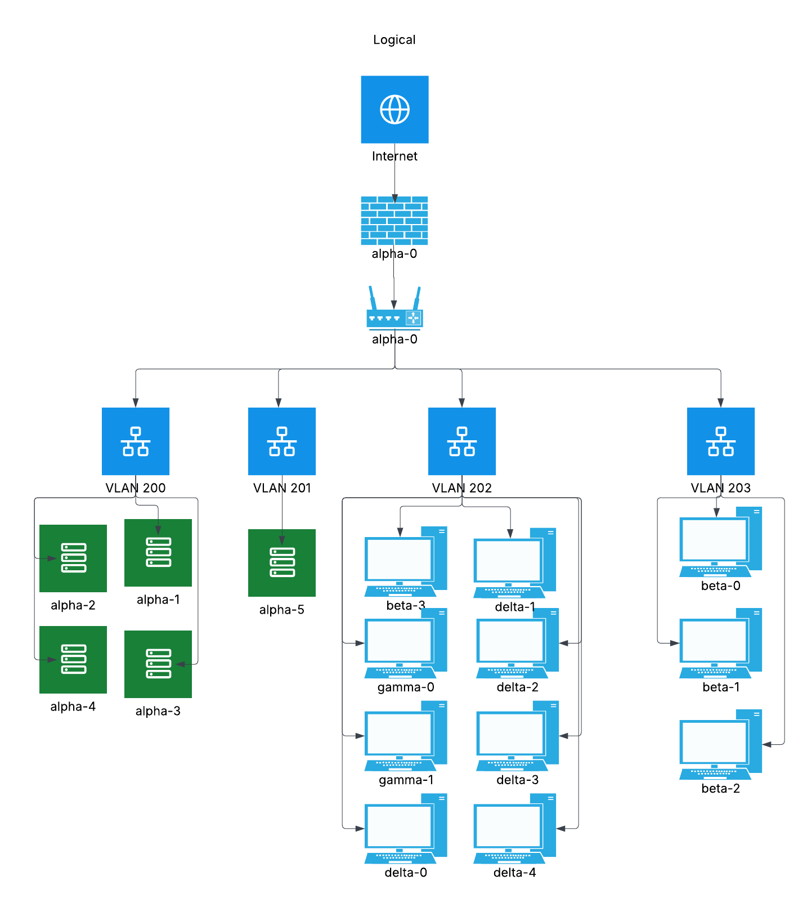

### Technologies & Software

Choose the technologies & software that you will use. Several technologies you may want to consider include:

1. **Router** (OPNSense)
1. **Firewall** (OPNSense)
1. **DNS** (BIND)
1. **IDS/IPS/SIEM** (Wazuh)
1. **Web Server** (Apache)
1. **VPN** (OPNSense)
1. **File Server** (TrueNAS)
1. **Database** (MySQL)
1. **Backup and Restore Solution** (Duplicati)
1. **DHCP Server** (OPNSense)
1. **Metric Server** (Node exporter, Prometheus, Grafana)

### Network Diagram

We wanted to provide seperate network switches for the VMs and the physical workstations. The VLANs are based on use cases such as servers, IT and Execs, and regualr employees. 

### Disaster Recovery
* We will do daily incremental backups onsite
* We will do weekly differentialy backups onsite and offsite
* We will do monthly full backups onsite and offsite
* We will do weekly VM snapshots onsite and offsite
* We have a backup AD, 

### Policies

#### Acceptable Use Policy
To make sure our Acceptable Use Policy is followed, we would combine both technical controls and awareness efforts. For example, we could block dangerous or non-work-related websites with DNS filtering and prevent users from installing unauthorized software through endpoint management tools. At the same time, we would regularly remind employees of what is and isn’t allowed with short training sessions and acknowledgment forms. This way, enforcement isn’t just about catching violations but also about helping people understand the rules from the start.
#### Password Policy
Enforcing our Password Policy would start with setting system-wide requirements through Active Directory, where we can control length, complexity, and reuse rules. To strengthen things further, we’d require multi-factor authentication, especially for remote access and admin accounts. We’d also make use of password filters that stop people from using common or already-compromised passwords. This way, employees don’t have to think too much about the rules—the systems enforce them automatically.
#### Access Control Policy
For access control, we’d rely on role-based access so that permissions are tied to someone’s job rather than given out individually. This prevents people from building up extra access over time. We’d also set up automatic account provisioning and deactivation linked to HR updates so that when someone joins, changes roles, or leaves, their access changes right away. On top of that, we’d schedule regular reviews of who has access to what, making sure nothing slips through the cracks.
#### Data Retention and Disposal Policy
We’d enforce our data retention rules by using storage and email systems that automatically delete or archive data based on the timelines we set. For example, old files that no longer serve a business purpose could be securely wiped, while records we’re legally required to keep would be archived properly. Backups would also follow the same rules, with retention schedules applied so that outdated or unneeded data isn’t hanging around in backup sets longer than it should. When it comes time to get rid of data, we’d use certified digital wiping tools or shredding services for paper, and we’d make sure backup tapes or disks are securely destroyed as well. Keeping records of these activities would help us prove compliance if needed.
#### Remote Access Policy
For remote work, we’d make sure that all employees connect through a secure VPN with multi-factor authentication. Firewalls would be configured so that only the VPN gateway can be used for remote access, reducing the risk of someone sneaking in another way. We’d also set requirements for any device connecting remotely, such as having current patches, antivirus, and disk encryption. By logging and reviewing remote sessions, we’d keep a close eye on unusual activity.
#### GDPR or CCPA Compliance
To enforce privacy regulations like GDPR and CCPA, we’d focus on controlling access to personal data and making sure it’s always protected. This would mean using encryption for both stored and transmitted data, and logging who accesses sensitive information. We’d also create automated processes so that if someone requests their data or asks for it to be deleted, we can respond quickly and consistently. Finally, our incident response plan would include the required breach notification steps so we stay compliant even if something goes wrong.
#### Security Incident Response Plan
To make our incident response plan effective, we’d put monitoring tools in place from a SIEM to collect logs and flag suspicious activity. We’d also write out playbooks that explain step-by-step what to do in common scenarios such as a malware infection or a phishing attack. Regular drills would help the team practice, so that in a real incident, people don’t waste time figuring out roles or next steps. After each incident, we’d hold a quick review to see what went well and what we can improve.
### Hardware Planning

#### Physical Workstations & Peripherals
* 7 Desktop computers
    * 7 power cables
    * 7 Ethernet cables
    * Minimum 8GB RAM, 256GB SSD, i5/Ryzen 5
    * Must have ethernet NIC
    * MFF if possible

* 7 Monitors, mice, keyboards
    * 7 Display Port cables
    * 7 power cables
    * 1080 or higher resolution
    * (For the sake of the class, we will be using KVMs and less monitors, mice, and keyboards. Number will depend on availiable KVM solution)

#### VM Specifications
* Total RAM: 64
    * 4 workstations: 4GB each
    * Linux1: 8GB
    * Linux2: 16GB
    * Linux3: 8GB
    * Win1: 8GB
    * Win2: 8GB
* Total CPU Cores: 24
    * 4 workstations: 2 each
    * Linux1: 2
    * Linux2: 6
    * Linux3: 2
    * Win1: 2
    * Win2: 4
* Total Storage: 2TB
    * 4 workstations: 64GB each
    * Linux1: 64GB
    * Linux2: 128GB
    * Linux3: 64GB
    * Win1: 128GB
    * Win2: 1TB
    * Additional storage: 512GB

#### Networking 
* 2 gigabit switches with minimum 6 ports

Switches, outers, access points, and patch cables.

On-site backup storage capacity and redundancy.
Plan for offsite backup if required for compliance or disaster recovery.

Other like thumb drives for installers, our own laptops for interfacing?

Networking Hardware:
Switches, routers, access points, and patch cables.
Include labeling for ports and cable runs for maintainability.

Backup and Recovery Hardware:
On-site backup storage capacity and redundancy.
Plan for offsite backup if required for compliance or disaster recovery.

add ethernet cables