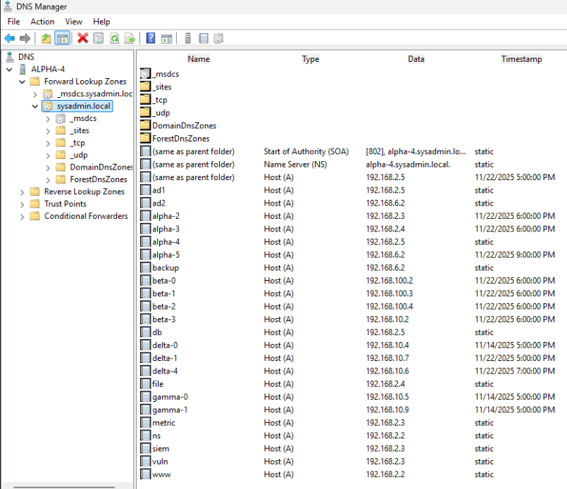
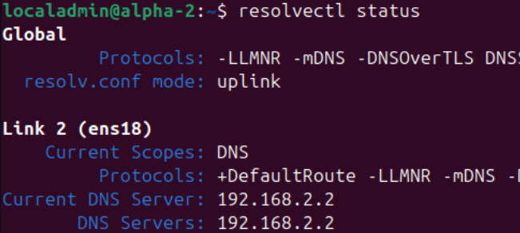
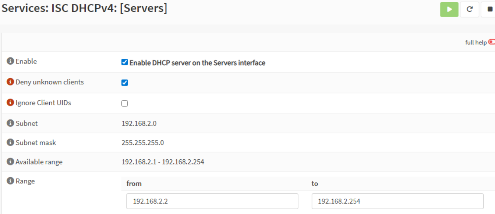
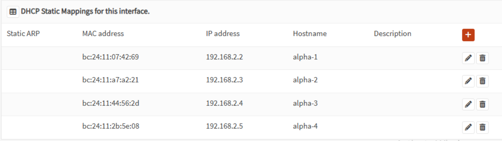
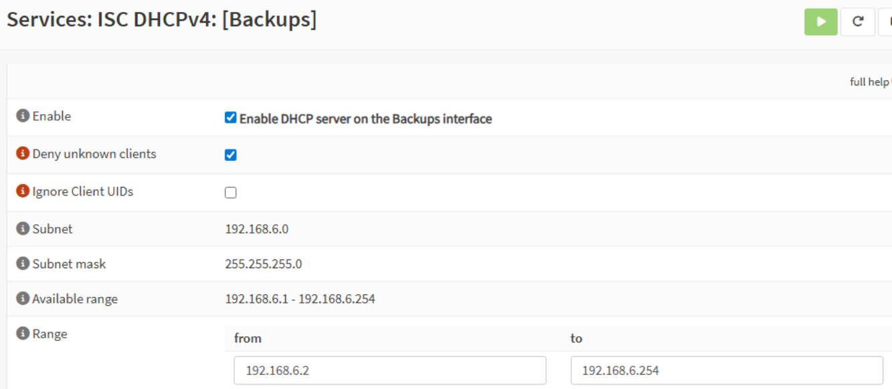
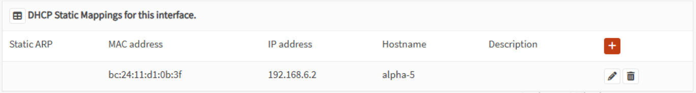
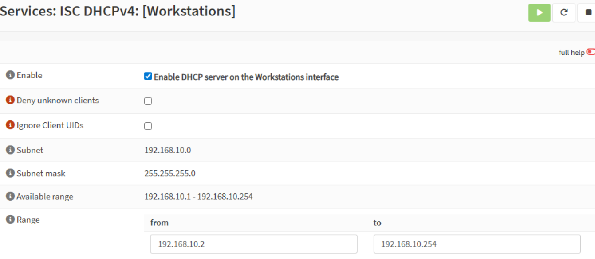
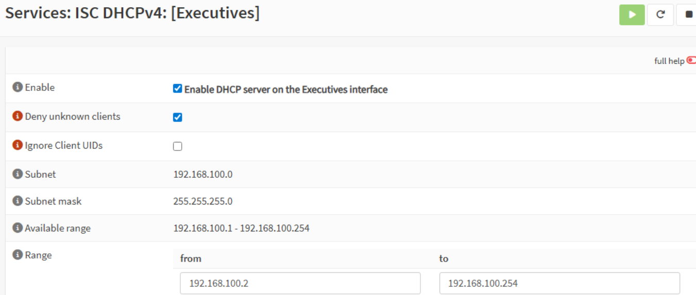

# Milestone 3

## AD & LDAP Setup

To create users or groups, first open "Active Directory Users and Computers" on the Domain Controller. Open the folder "Users" (or other desired OU), and it will list all users and groups on the right panel. From the toolbar, select either "Create a new user in the current container" or "Create a new group in the current container". For creating a new user, fill in "Full name" and "User logon name" in the dialog box, press next, assign the password and account policies, press next, then review the information and press finish. For creating a new group, simply input the group name and press ok. 

To assign permissions to users or groups, right-click on the user or group and select "Properties". The opened dialog box will contain several tabs for managing the properties of the user/group, including permissions which can primarily be found and assigned in the "Member Of" tab. In this tab, users and groups can be assigned membership of other groups that have permissions associated with them (e.g., giving a user administrator rights by assigning them membership in the Administrators group). Simply click add, enter the name of the permissions group, check names, then press ok. 

Modifying and disabling user accounts can initially done in creating a new user, but can be revisited in another tab of "Properties". Most pertinent account settings, including disabling the account, can be located in the "Account" tab.

The Microsoft supported method of backing up Active Directory (running on a Windows Server) is with a System State Backup, installed in Powershell with "Install-WindowsFeature Windows-Server-Backup". Then you would run the backup with "wbadmin start systemstatebackup -backupTarget:\\SERVER\Backups -quiet" (\\SERVER\ could also be replaced with a local hard drive, such as D:). To run a non-authoritative restore (where one domain controller goes down), boot into Directory Services Restore Mode on the downed DC and run "wbadmin start systemstaterecovery -version:<timestamp> -backupTarget:D: -quiet". After rebooting, the downed DC will update by replicating from an active Domain Controller. 

## User Accounts & Groups
Security Groups and Users

Executive group: Albert Tay, Emily Brown

IT group: Alex Patel, Eric Nguyen

Employees group: Ben Anderson, Jessica Rodriguez, Karen Taylor, Olivia Davis, Rachel Nguyen, Ryan Lee

Organizational Units

Backups: ALPHA-5

Executives: BETA-0, BETA-1, BETA-2

Servers: ALPHA-0, ALPHA-1, ALPHA-2, ALPHA-3

Workstations: BETA-3, DELTA-0, DELTA-1, GAMMA-0, GAMMA-1

Domain Controllers: ALPHA-4

## Group Policies
Password & Security Policy (applied to all groups and devices)
- Enforce minimum password length: 12 characters
- Require complex passwords
- Set account lockout after 5 failed login attempts

Software Deployment
- Block all .exe installs from user downloads
  
Access Control
- Once SMB is up (Milestone 4), we will map network drives based on department (e.g., HR_Shared, Sales_Shared)
- Limit access to servers and admin consoles according to user group
- Spicy Cluck Co. will enforce Multi-factor authentication using Duo for all logins

Administrative Rights
- IT Managers and Network Admins: Full admin on servers and devices relevant to IT operations
- Executives: Limited delegation for business-critical apps
- All other users: Standard user privileges; no local admin rights

Device Configuration
- Company-standard desktop configuration (Including standard wallpaper, taskbar, etc.)
- Restrict USB and removable media access for sensitive groups

All of the above policies are enforced.

## DNS Configuration
The DNS server is configured on alpha-1 which runs BIND9 on an Ubuntu Server and has the IP Address 192.168.2.2. The Domain Controller is set as the authoritative server for the domain "sysadmin.local" whereas the DNS server is set as the primary DNS that forwards any local domain requests to the DC. The DNS server also forwards all external domain resolution to the IP addresses 1.1.1.1 and 8.8.8.8. 

The records on the DC including manually added ones and hostnames from devices connected to the domain.

The config that forwards all local domain resolution requests to the DC.

The config that forwards all external domain resolution to external DNS servers.

The router assigns DNS servers to the devices as it gives DHCP leases. alpha-2 can see what DNS server it is using.

alpha-2 has no problem resolving the local domain "www.sysadmin.local" and the public domain "google.com" and reaching both.

## DHCP Setup
DHCP has been configured for each individual VLAN. DHCP is being used to statically assign IP addresses to all servers and dynamically assign IP addresses for all workstations. The full range of IP addresses for the subnet is given to DHCP to assign IP addresses to devices. DHCP also assigns the default gateway (which is the first address of the subnet) for each VLAN and the DNS server (192.168.2.2).

#### DHCP Config and Static IPs for VLAN 200 - Servers

Static IPs are assigned for the servers because of the services they provide on the network and the IPs shouldn't change to ensure continuous connectivity.

#### DHCP Config and Static IPs for VLAN 202 - Backups

Static IP for the backup server is assigned for a similar reason as the other servers.

#### DHCP Config for VLAN 202 - Workstations

No static IPs are assigned for workstations.

#### DHCP Config for VLAN 203 - Executives

No static IPs are assigned for executive workstations.

## Firewall Rules
The reasoning behind our firewall rules is relatively simple. The network requires access to the internet at large, meaning we need to have ports 80, 443, 123, and 53 allowed for HTTP, HTTPS, NTP, and DNS respectively. Each machine within the system must also have access to Active Directory, requiring the inclusion of ports 88, 636, and 135 for Kerberos, Encrypted LDAP, and RPC, respectively. Each VLAN has rules allowing it a certain amount of access to other VLANs. Executives, for example, are given access to all other VLANs because of their role. For the moment, the Backups VLAN is given the same level of permission to ensure that everything can be backed up properly. This may be revised in the future as deemed necessary. Workstations really only need an internet connection, and the rules reflect that need.

The firewall rules can be viewed in [this backup file](BackupFile.xml).

## Network Diagrams

No updates to logical or physical diagrams from previous milestone.

