# Milestone 4

## File Server Configuration
#### Folder structure and mapping to groups
We are using TrueNAS on a VM in Proxmox for our file server. There is a secondary virtual drive other than the boot drive which has a pool called "general." Under general there are directories mapped to our three groups: executives (exec), IT (it), and Employees (empl). There is an SMB share for each of these directories.

TrueNAS SMB Shares


#### Access rights per folder
The TrueNAS file server is joined to AD for access control. The shares can only be mapped by the appropriate individuals. Additionally, acess can be set as read, change, and full (we do not currently have any that are read-only). Below is the access allowed for each share:

exec
	-Executives: change
	-Alex Patel: full

it
	-IT: full

empl
	-IT: full
	-Executives: change
	-Employees: change


ACL For Executive Share


ACL For IT Share
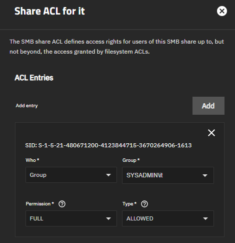

ACL For Employee Share
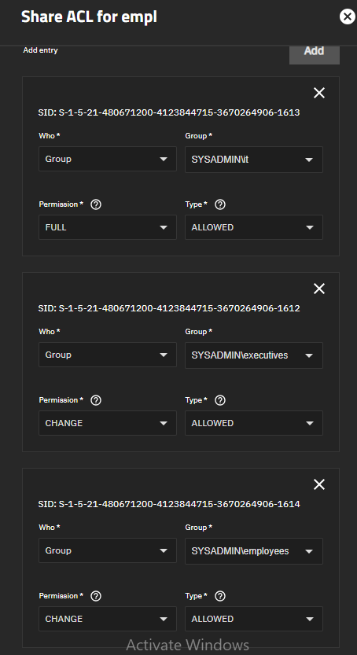

Example: Alex Patel can access all three shares
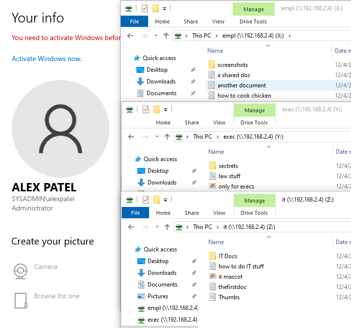

Example: Ben Anderson can access Employee share but is denied connecting to IT share
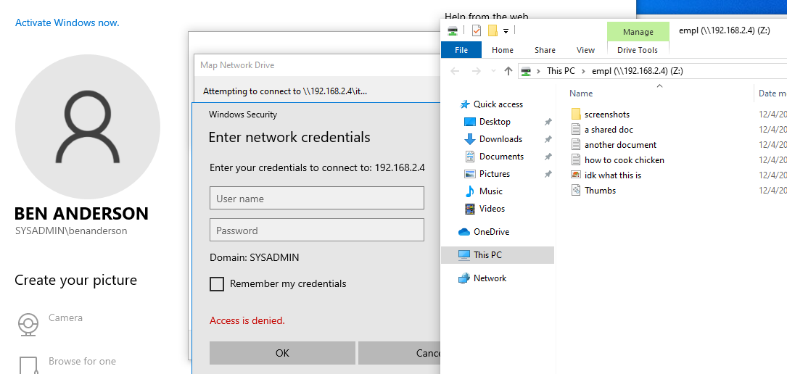

#### Backup schedules and locations

!!!!!!!!!!!!!!!!EITHER FILL THIS OUT OR DELETE IT!!!!!!!!!!!!!!!!!11

#### Troubleshooting tips
When using TrueNAS in Proxmox and adding a pool on a virtual drive, you must assign the virtual drive a serial number. This can be done by adding ```serial=<make up a serial>``` to the end of the line in the config file for the drive on the host's shell.

We also had some trouble with joining the TrueNAS server to the domain. This turned out to be due to a time difference between the domain controller and TrueNAS machine. 

## Vulnerability Scanning

#### Setup and Configuration
We are using Nessus, an easy to install and intuitive vulnerability scanner, to scan the network for vulnerabilities. Nessus can be installed by going to the Downloads page and selecting the right download package for your Operating System. This can also be done via the command line using wget. Then you install the package and let it configure itself and install all of the necessary plugins. Once it is done it will deploy a web interface on port 8834. It will walk you through the steps of creating an admin account. It will eventually bring you to the login page where you can log in with the account you just created.


Once logged in and all plugins are installed, you can click the New Scan button in the top right corner to Configure a scan of your machines.

We have a scan of all machines in our Servers VLAN along with the router that is scheduled to scan once a week.


#### Scan Results
Here are the results of the scan of our main servers.
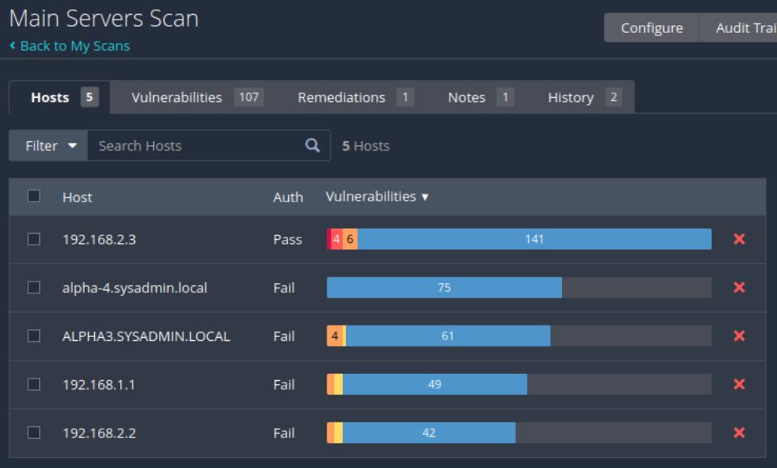

Windows Credentialed Scan


Linux Credentialed Scan
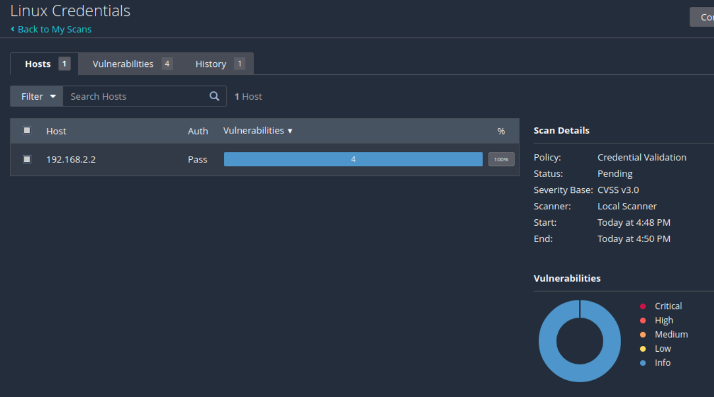

## VPN Server
* Installation steps and configuration

Created CA

Created User Certificate

Created VPN instance

Important configurations:

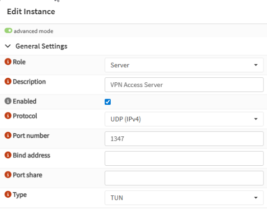
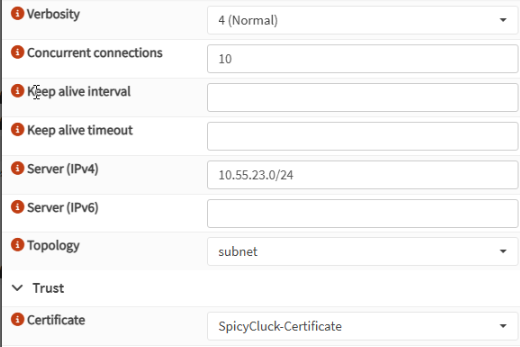
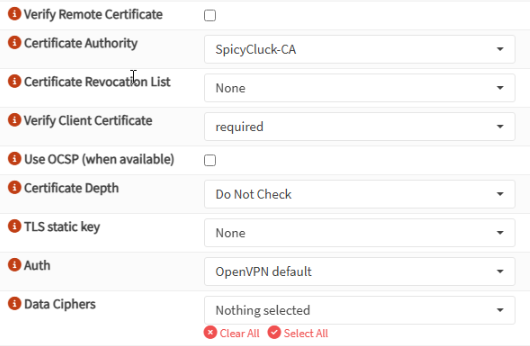
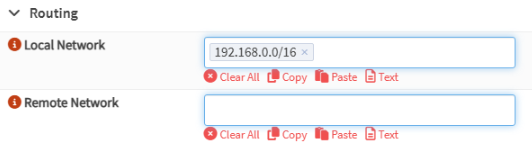

* Authentication methods

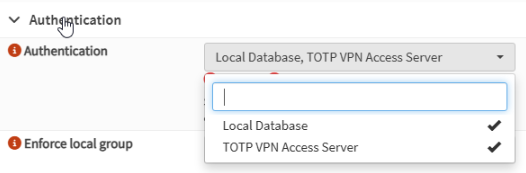

* Connection instructions for remote users

Install OpenVPN

Download .ovpn file from opnsense

Upload and import .ovpn file 

Sign in with valid credentials and MFA app such as Duo Mobile

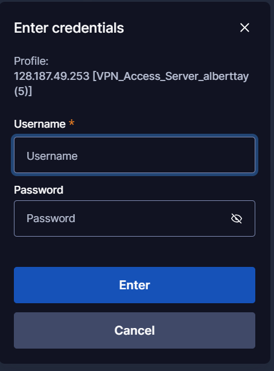
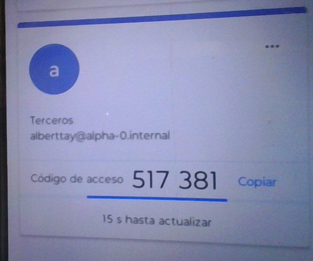

* Firewall and port forwarding configuration

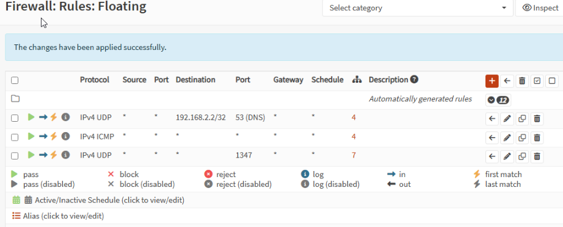


* Test results and troubleshootign steps

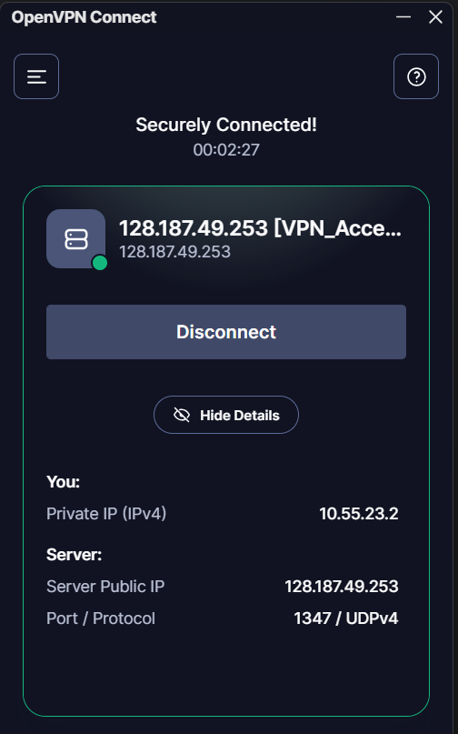


## SIEM & Endpoint Protection

We decided to use Wazuh as our SIEM and Endpoint Detection software. Because the network is not very large, we decided to use the all-in-one script meaning that all three parts of Wazuh (Server, Manager, and Dashboard) are installed on the same device. After the installation, we were provided with the initial login credentials which we changed. In the dashboard, there are instructions provided for deploying agents on other machines.

We installed agents on all devices for general log collection.
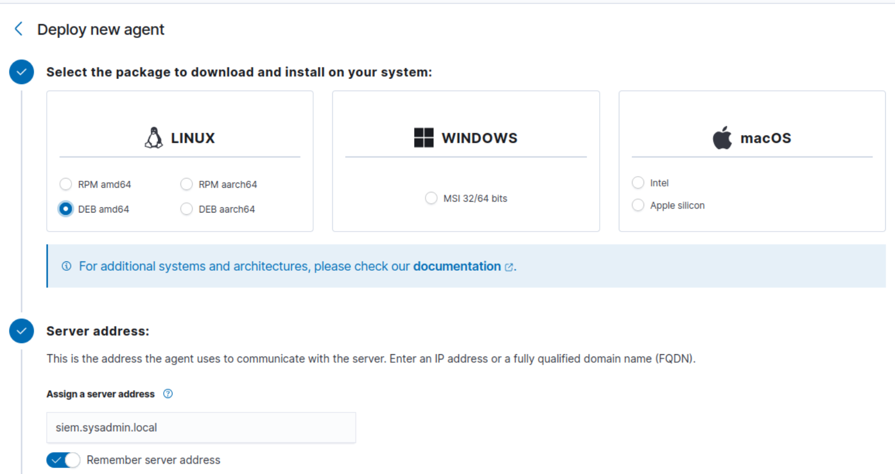
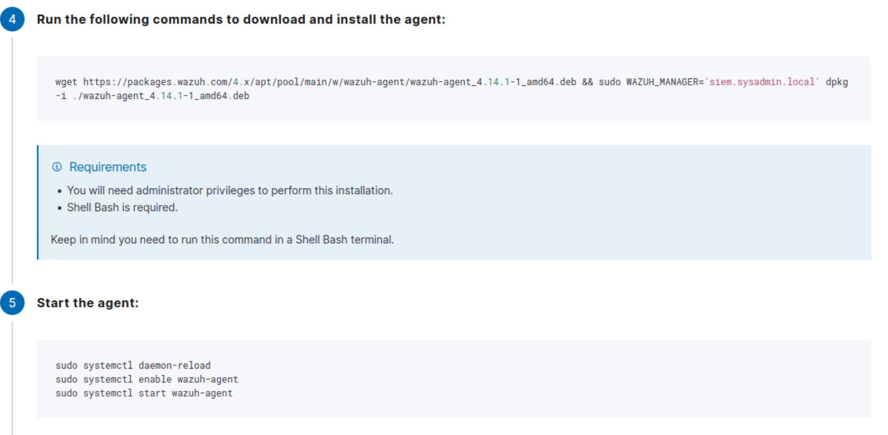

We can see the devices that have been registered in Wazuh and whether they are up and running or not. We can also see the initial dashboard of the alerts that they generate.
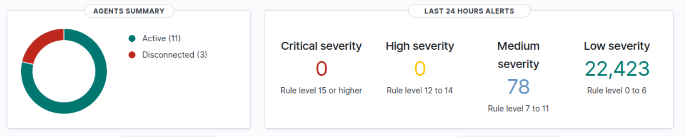

We also deployed 2 Wazuh agents that acted as antivirus/EDR software on the machines. We did this by installing and using sysmon on the endpoints which provides the EDR-level telemetry. We made a group for our edr agents to be able to monitor and edit their configuration.


## Configuration Files
* VPN

* File Server

	TrueNAS System Configuration: milestone4/ALPHA3-25.10.0.1-20251206184633.tar
* SIEM & EDR

[SIEM & EDR Configurattion](wazuh-backup.tar.gz)


## Security Policies: Update documentation to reflect changes in policies from this milestone:
Password & access control.
VPN access restrictions.
Endpoint protection enforcement.
File server permissions.

## Network Diagrams
Physical network diagram
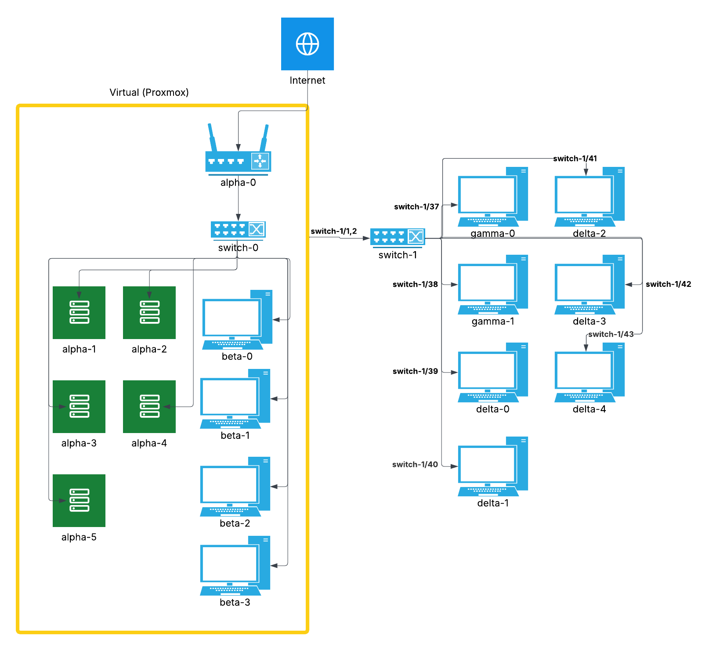
Logical network diagram
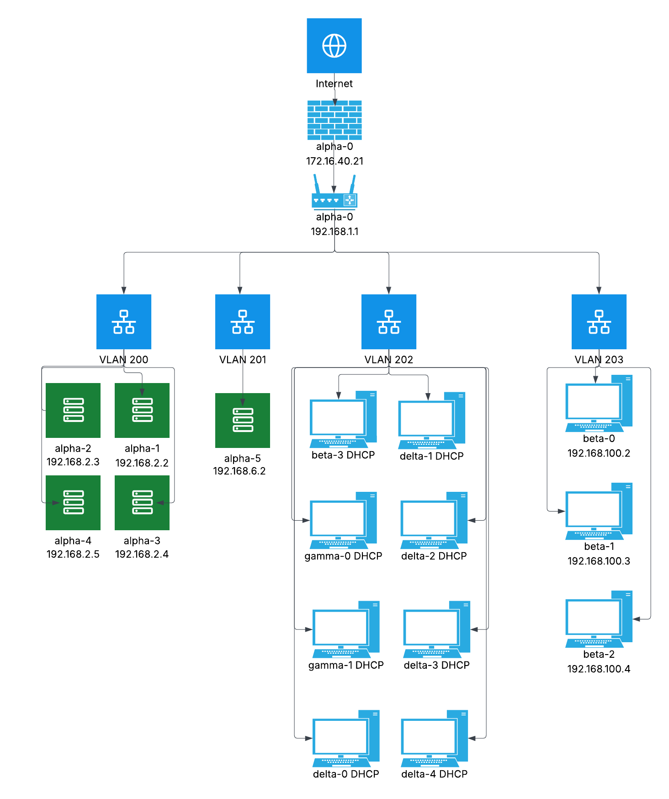


## Backup & Recovery Procedures: Include instructions for restoring file server and metric server configurations.

## Change Log: Track all updates to Group Policies, firewall rules, and system configurations.