# Milestone 6

## Introduction


This document provides the complete technical documentation for Spicy Cluck Co.’s fully deployed and validated multi-VLAN, enterprise-grade hybrid infrastructure. Throughout this project, our team designed, implemented, and secured a production-ready environment that reflects the architecture, operational workflows, and security requirements of a modern organization.

This infrastructure integrates physical hardware, virtualized servers, centralized identity and access management, network segmentation, role-based access controls, firewall enforcement based on least privilege, DNS services, secure remote access, vulnerability management, and resilient file storage.

The goal of this deployment is to provide a scalable, maintainable, and security-focused environment that supports the company’s operational needs while aligning with industry best practices. All systems documented here have been tested and validated for functionality, security, and interoperability.

## Asset Inventory
#### Physical Workstations & Peripherals
* 7 Desktop computers
    * 7 power cables
    * 7 Ethernet cables
    * 8GB RAM, 256GB SSD, Intel Core i5
    * Ethernet NIC
    * Micro Form Factor
    * 4 thumbdrives for OS installers

* 2 Monitors, mice, keyboards
    * 7 Display Port cables
    * 2 power cables
    * 2 1080 monitors
    * 1 KVM
    * 2 USB hubs

#### VM Specifications
* Total RAM: 176
    * alpha-0: 16GB
    * alpha-1: 16GB
    * alpha-2: 32GB
    * alpha-3: 16GB
    * alpha-4: 16GB
    * alpha-5: 16GB
    * beta-0: 16GB
    * beta-1: 16GB
    * beta-2: 16GB
    * beta-3: 16GB
    
* Total CPU Cores: 44
    * alpha-0: 4
    * alpha-1: 4
    * alpha-2: 8
    * alpha-3: 4
    * alpha-4: 4
    * alpha-5: 4
    * beta-0: 4
    * beta-1: 4
    * beta-2: 4
    * beta-3: 4

* Total Storage: 492GB
    * alpha-0: 32GB
    * alpha-1: 20GB
    * alpha-2: 20GB
    * alpha-3: 20GB
    * alpha-4: 100GB
    * alpha-5: 100GB
    * beta-0: 50GB
    * beta-1: 50GB
    * beta-2: 50GB
    * beta-3: 50GB

#### Networking 
* 48 port switch with 2 PSUs
* Console cable
* 9 ethernet cables
* Switch and cable assignments:

    |   Switch Port |   Destination    |
    |-----|-----|
    |   1,2             |   Proxmox Switch  | 
    |   37  |   delta-6 |
    |   38  |   gamma-1 |
    |   39  |   delta-0 |
    |   40  |   delta-1 |
    |   41  |   delta-2 |
    |   42  |   delta-3 |
    |   43  |   delta-4 |

#### VM Tagging and Pooling Strategy
* Descriptive, role based tags: dhcp, firewall, router, vpn, backup-server, dns, web-server, active-directory, db-server, metric-server, siem, vulnerability-scanner, file-server, workstation
* 2 pools: Servers-alpha & Workstations-beta

## Software Inventory
* **Router:** OPNSense
* **Firewall:** OPNSense
* **DNS:** BIND
* **SIEM & Endpoint Protection:** Wazuh
* **Vulnerability Scanning:** Nessus
* **Web Server:** Apache
* **VPN:** OPNSense
* **File Server:** TrueNAS
* **Database:** MySQL
* **Backup and Restore Solution:** Duplicati
* **DHCP Server:** OPNSense
* **Directory and Authentication:** Active Directory
* **Operating Systems:** Ubuntu, Kali Purple, Debian, Fedora, Windows Pro, Windows Server, TruNAS
* **Browser:** Chrome, Edge, Firefox
* **Code Editor:** VS Code

## Network Diagrams
Physical network diagram

Logical network diagram
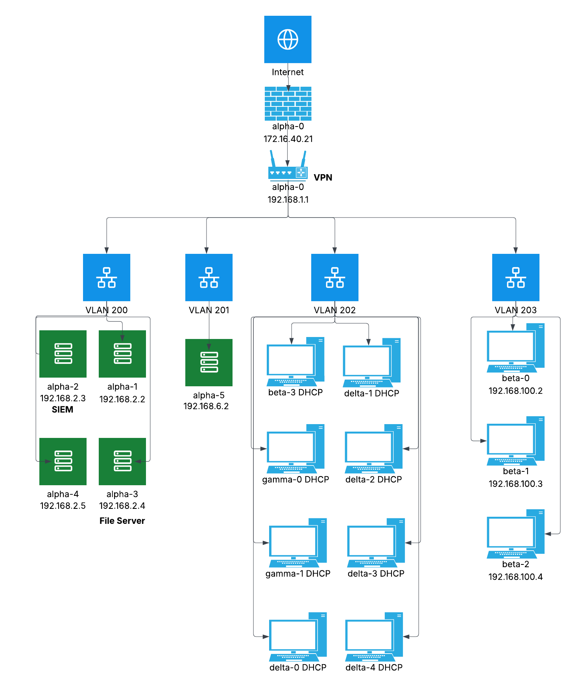

## Network Tables

## Firewall Rules
The reasoning behind our firewall rules is relatively simple. The network requires access to the internet at large, meaning we need to have ports 80, 443, 123, and 53 allowed for HTTP, HTTPS, NTP, and DNS respectively. Each machine within the system must also have access to Active Directory, requiring the inclusion of ports 88, 636, and 135 for Kerberos, Encrypted LDAP, and RPC, respectively. Each VLAN has rules allowing it a certain amount of access to other VLANs. Executives, for example, are given access to all other VLANs because of their role. Additional ports to allow traffic for the File Server were added, specifically ports 137-139 and 445. We also allowed inbound traffic on ports 1514 and 1515 for our SIEM. These ports are necessary for TrueNAS to function as intended. Each of these ports was allowed for each VLAN, and no other rules were added so that the principle of least privilege was followed as closely as possible.

Each VLAN in our system allows ports needed for basic internet access as well as access to the file server and the SIEM. However, we have also implemented a deny-by-default rule to follow secuirty best practice and to enforce least privilege access. Each VLAN can only access what is absolutely necessary, and no more.

All firewall rules can be viewed in [this config file](config.xml).

## DNS Configuration

The DNS server is configured on alpha-1 which runs BIND9 on an Ubuntu Server and has the IP Address 192.168.2.2. The Domain Controller is set as the authoritative server for the domain "sysadmin.local" whereas the DNS server is set as the primary DNS that forwards any local domain requests to the DC. The DNS server also forwards all external domain resolution to the IP addresses 1.1.1.1 and 8.8.8.8. 


The records on the DC including manually added ones and hostnames from devices connected to the domain.


The config that forwards all local domain resolution requests to the DC.
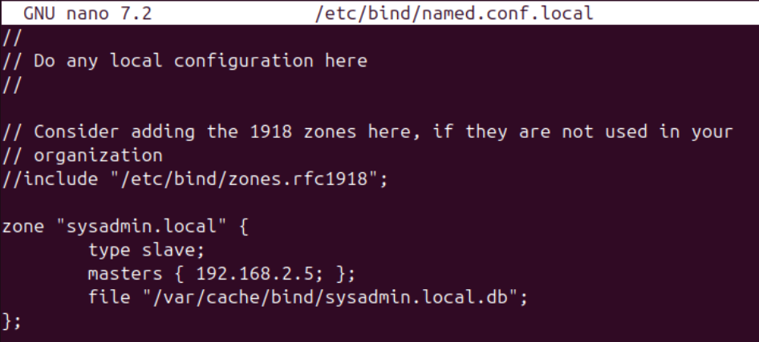

The config that forwards all external domain resolution to external DNS servers.
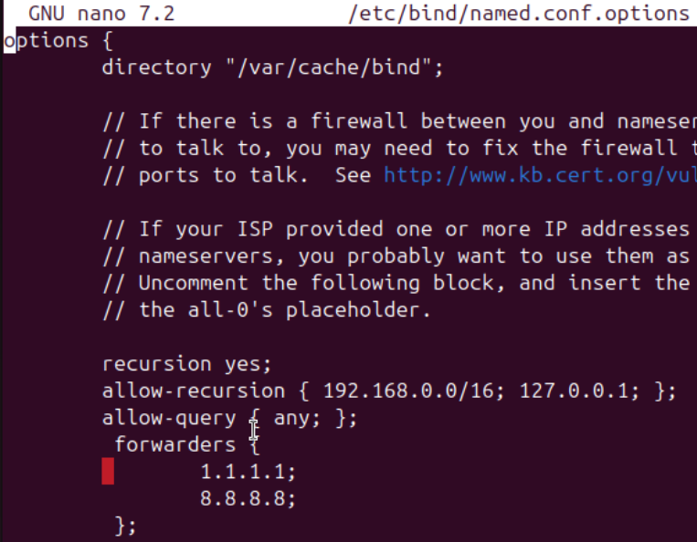

The router assigns DNS servers to the devices as it gives DHCP leases. alpha-2 can see what DNS server it is using.


alpha-2 has no problem resolving the local domain "www.sysadmin.local" and the public domain "google.com" and reaching both.
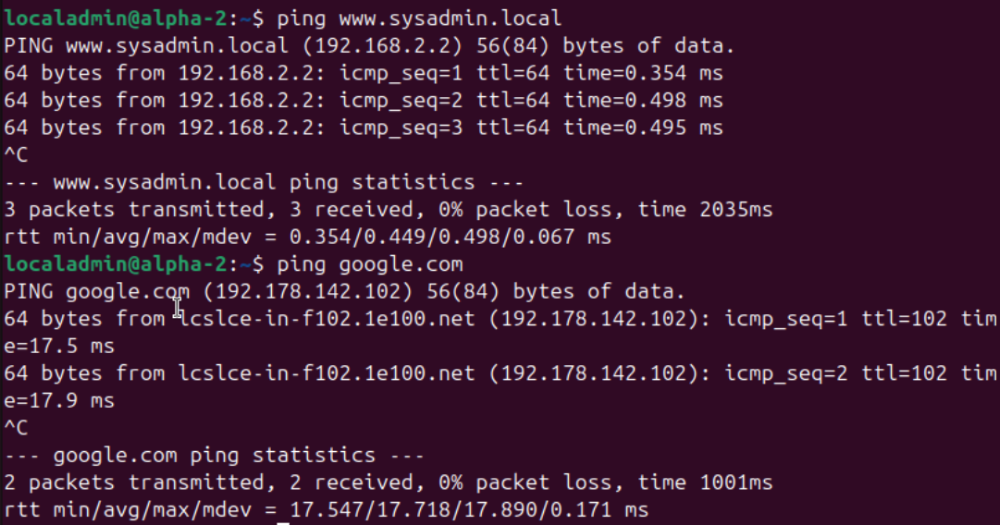


## File Server
#### Folder structure and mapping to groups
We are using TrueNAS on a VM in Proxmox for our file server. There is a secondary virtual drive other than the boot drive which has a pool called "general." Under general there are directories mapped to our three groups: executives (exec), IT (it), and Employees (empl). There is an SMB share for each of these directories.

TrueNAS SMB Shares

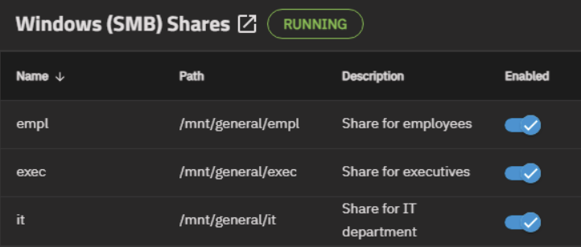

#### Access rights per folder
The TrueNAS file server is joined to AD for access control. The shares can only be mapped by the appropriate individuals. Additionally, acess can be set as read, change, and full (we do not currently have any that are read-only). Below is the access allowed for each share:

exec
    -Executives: change
    -Alex Patel: full

it
    -IT: full

empl
    -IT: full
    -Executives: change
    -Employees: change


ACL For Executive Share

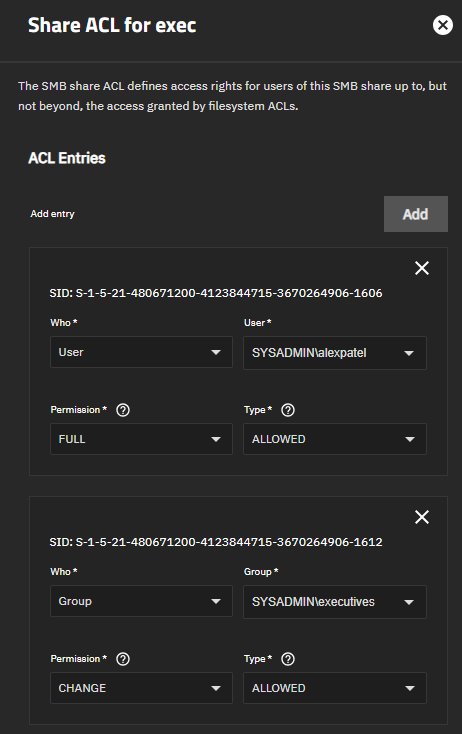

ACL For IT Share


ACL For Employee Share


Example: Alex Patel can access all three shares


Example: Ben Anderson can access Employee share but is denied connecting to IT share


#### Troubleshooting tips
When using TrueNAS in Proxmox and adding a pool on a virtual drive, you must assign the virtual drive a serial number. This can be done by adding ```serial=<make up a serial>``` to the end of the line in the config file for the drive on the host's shell.

Also be sure to sync the time between the domain controller and TrueNAS machine (and all machines).

## Active Directory Integration

The computer network at Spicy Cluck Co. is unified by Windows Active Directory on the Spicy Cluck domain. Employees can login to any workstation computer available with the same domain credentials and access resources based on their specific role. 

To add a *Windows* computer to the domain, simply open `Settings`, navigate to `System > About`, open the link `Domain or workgroup`, then click the `Change` button on the new System Properties window next to the text `To rename this computer, click Change`. Clicking `Change` will bring up a new window displaying text boxes to change the hostname, domain, or workgroup. Enter a new hostname in the first text box according to the company's naming convention (Alpha for servers, Beta for virtual workstations, Delta for physical workstations, and Gamma for hybrid workstations). Next, select the Domain dialogue button option under the `Member of` box, then enter `sysadmin.local` into the associated text box. Afterwards, you will be prompted to enter credentials; enter the Domain Administrator credentials and allow time for some brief loading. Finally, restart the computer. 

To add a *Linux* based computer to the domain, the exact details for packages and configurations differ slightly according to the distro, but these are the general guidelines. First, change the hostname according to the aforementioned naming scheme. Next, add the fully qualified domain name and new hostname to a newline in the hosts file under `127.0.0.1 localhost`: `127.0.1.1 hostname.sysadmin.local hostname`. Next, edit the `resolv.conf` file to point to the Domain Controller as only DNS server and add the domain (`sysadmin.local`), then restart. Ensure that the computer is synchronized with the Domain Controller (recommended to use package `chrony`). Install all of the following packages or alternatives: `realmd`, `sssd`, `sssd-tools`, `krb5-user`, `adcli`, `oddjob`, `oddjob-mkhomedir`, and `samba-common-bin`. Next, ensure that the `krb5.conf` file resembles:
```
[libdefaults]
    default_realm = SYSADMIN.LOCAL
    dns_lookup_realm = true
    dns_lookup_kdc = true
    rdns = false
    ticket_lifetime = 24h
    forwardable = true
    permitted_enctypes = aes256-cts-hmac-sha1-96 aes128-cts-hmac-sha1-96 rc4-hmac

[realms]
    SYSADMIN.LOCAL = {
        kdc = alpha-4.sysadmin.local
        admin_server = alpha-4.sysadmin.local
    }

[domain_realm]
    .sysadmin.local = SYSADMIN.LOCAL
    sysadmin.local = SYSADMIN.LOCAL

```
Afterwards, run `klist` and `kinit Administrator` to ensure that Kerberos is working. Finally, run the following (with putting in credentials and restarting after) to join the domain:
```
sudo realm join -U Administrator --verbose sysadmin.local

```
After a computer is added to the domain, open `Active Directory Users & Computers` on the Domain Controller. There is default folder that stores all newly joined computers. Navigate to the folder, locate the new computer, then move it to the correct OU. 

To create users or groups, first open `Active Directory Users and Computers` on the Domain Controller. Open the folder `Users` (or other desired OU), and it will list all users and groups on the right panel. From the toolbar, select either `Create a new user in the current container` or `Create a new group in the current container`. For creating a new user, fill in `Full name` and `User logon name` in the dialog box, press next, assign the password and account policies, press next, then review the information and press finish. For creating a new group, simply input the group name and press ok.

To assign permissions to users or groups, right-click on the user or group and select `Properties`. The opened dialog box will contain several tabs for managing the properties of the user/group, including permissions which can primarily be found and assigned in the `Member Of` tab. In this tab, users and groups can be assigned membership of other groups that have permissions associated with them (e.g., giving a user administrator rights by assigning them membership in the Administrators group). Simply click add, enter the name of the permissions group, check names, then press ok.

Modifying and disabling user accounts can initially done in creating a new user, but can be revisited in another tab of `Properties`. Most pertinent account settings, including disabling the account, can be located in the `Account` tab.

The Microsoft supported method of backing up Active Directory (running on a Windows Server) is with a System State Backup, installed in Powershell with `Install-WindowsFeature Windows-Server-Backup`. Then you would run the backup with `wbadmin start systemstatebackup -backupTarget:\SERVER\Backups -quiet` (\SERVER\ could also be replaced with a local hard drive, such as D:). To run a non-authoritative restore (where one domain controller goes down), boot into Directory Services Restore Mode on the downed DC and run `wbadmin start systemstaterecovery -version: -backupTarget:D: -quiet`. After rebooting, the downed DC will update by replicating from an active Domain Controller.

Finally, many permissions associated with OUs are assigned through `Group Policy`, accessible on the Domain Controller. Please refer to the existing group policies and official company policies for assigning permissions to the OUs. 

## Vulnerability Management

#### Setup and Configuration
We are using Nessus, an easy to install and intuitive vulnerability scanner, to scan the network for vulnerabilities. Nessus can be installed by going to the Downloads page and selecting the right download package for your Operating System. This can also be done via the command line using wget. Then you install the package and let it configure itself and install all of the necessary plugins. Once it is done it will deploy a web interface on port 8834. It will walk you through the steps of creating an admin account. It will eventually bring you to the login page where you can log in with the account you just created.
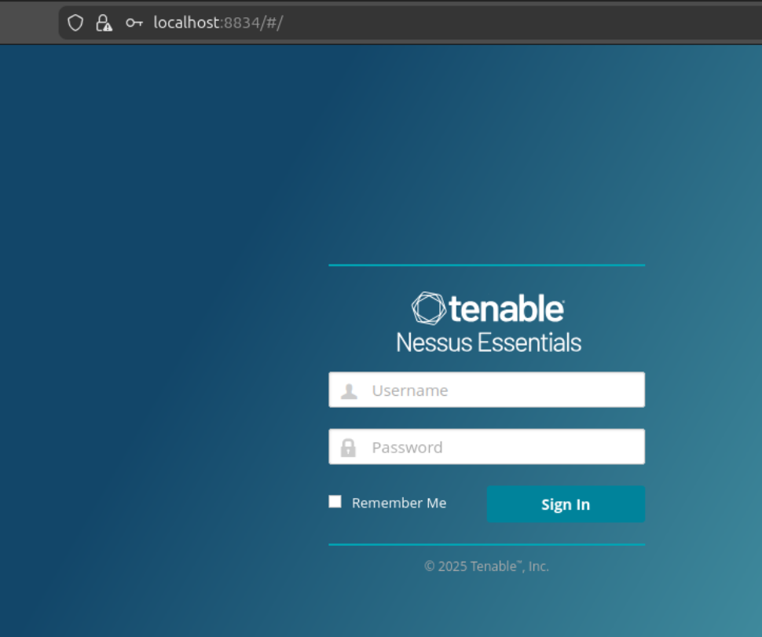

Once logged in and all plugins are installed, you can click the New Scan button in the top right corner to Configure a scan of your machines.

We have a scan of all machines in our Servers VLAN along with the router that is scheduled to scan once a week.
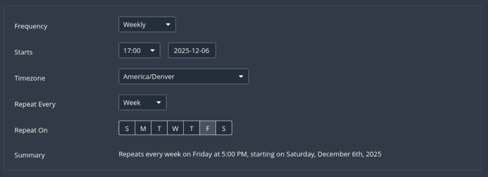

#### Scan Results
Here are the results of the scan of our main servers.


Windows Credentialed Scan
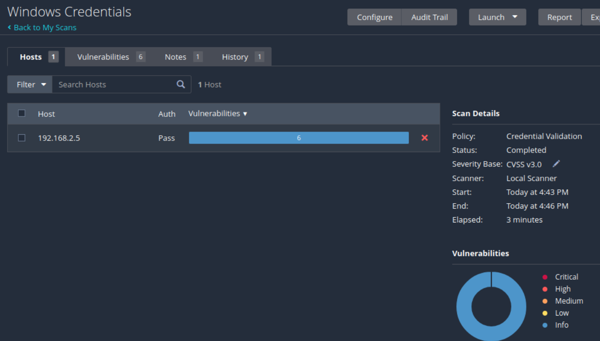

Linux Credentialed Scan


## VPN Access


We are using OpenVPN because it is the VPN service we were most familiar with. It is also easier to set up than other services and integrates nicely with OPNsense. To make this work, we created a firewall rule to allow traffic coming to the WAN from anywhere on port 1347. The image below shows this as a floating rule applied to all interfaces. This is overly permissive, and we would restrict this rule to just the WAN interface, but since we no longer have access to the IT&C VPN, this is the best representation we have.


We also created a port forwarding rule from our WAN to our router/vpn server.

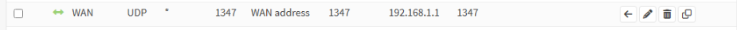

To connect to the VPN, contact Eric Nguyen (Network Administrator). He will send you a .ovpn file for you to download and import into OpenVPN. You will then click Connect and be brought to the following login page where you will use your company credentials.


If your credentials are invalid, please contact Eric again and he can help you. After logging in, you should be prompted to set up a multi-factor authenticator app. Do so and enjoy your remote connection! If connected successfully, you should see a screen like the following.

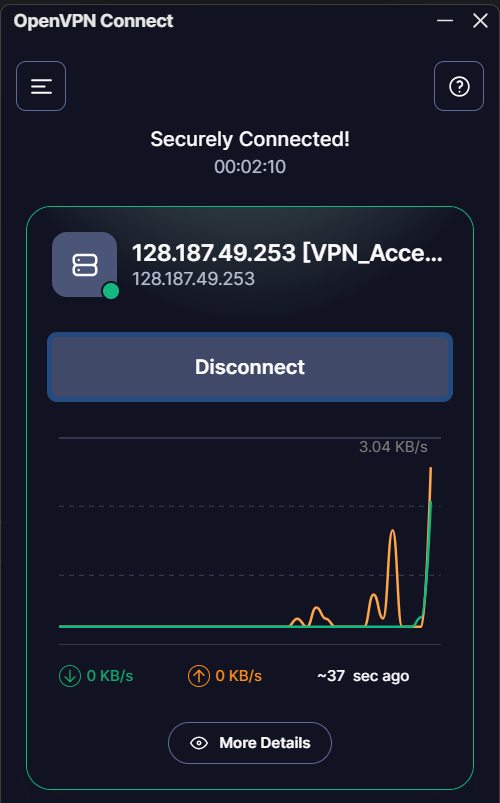

It may take a minute or two to connect. If you have any issues, contact Eric Nguyen (Network Administrator).

## Backup & Disaster Recovery Policy

Our entire Backup & Disaster Recovery Policy can be viewed [here](/milestone5/milestone5.md). 

## [Final Presentation](/milestone6/Sysadmin_final_pres.pdf)

### Separate Files to Include:

Switch configuration & VLAN database:
[VLANs](m6_screenshots/VLANs.png)

We didn't save the switch configurations, so here are the details we configured through PuTTY. Ports 1 and 2 are configured as a trunked uplink and are bundled together using an EtherChannel for increased bandwidth and redundancy. They serve as the connection to the internet gateway with VLAN 1 and 202 as the only permitted VLAN. Ports 3 through 48 are configured as access ports allowing only VLAN 202. These ports are intended for end-user workstation devices.


DNS server configuration (see `DNS Configuration` above)

Database schema in SQL format (wiki database)

Web server configuration: We didn't save the configuration file, so here are the details. Installed with: apt install apache2. Default HTTP only (port 80). Document root: /var/www/html/ Default site config: /etc/apache2/sites-available/000-default.conf No custom changes — stock Apache installation.

File server configuration:
[TrueNAS Configuration](ALPHA3-25.10.0.1-20251206184633.tar)

AD configuration: We didn't save the configurations, so here are the details. The Security Groups are: Executives, IT, and Employees. The Employees group has basic user permissions. The Executives group has protected user permissions. The IT group has administrator privileges. The users for Albert Tay and Emily Brown are in the Executives group. The users for Alex Patel and Eric Nguyen are in the IT group. The users for Ben Anderson, Jessica Rodriguez, Karen Taylor, Olivia Davis, Rachel Nguyen, and Ryan Lee are in the Employees group. The Organizational Units and listed machines are: Backups (ALPHA-5), Executives (BETA-0, BETA-1, BETA-2), Servers (ALPHA-0, ALPHA-1, ALPHA-2, ALPHA-3), Workstations (BETA-3, DELTA-0, DELTA-1, GAMMA-0, GAMMA-1), and Domain Controllers (ALPHA-4). According to Group Policy: only users from the IT group can login to machines every OU; users from the Executives group can login to machines in the Executives and Workstations OUs; Employees can only login to the Workstations OU. 

Risk assessment

Most recent vulnerability scan reports (see `Scan Results` under `Vulnerability Management` above)

VPN server configuration:
[OpenVPN Configuration](VPN_Access_Server_alberttay.ovpn)


