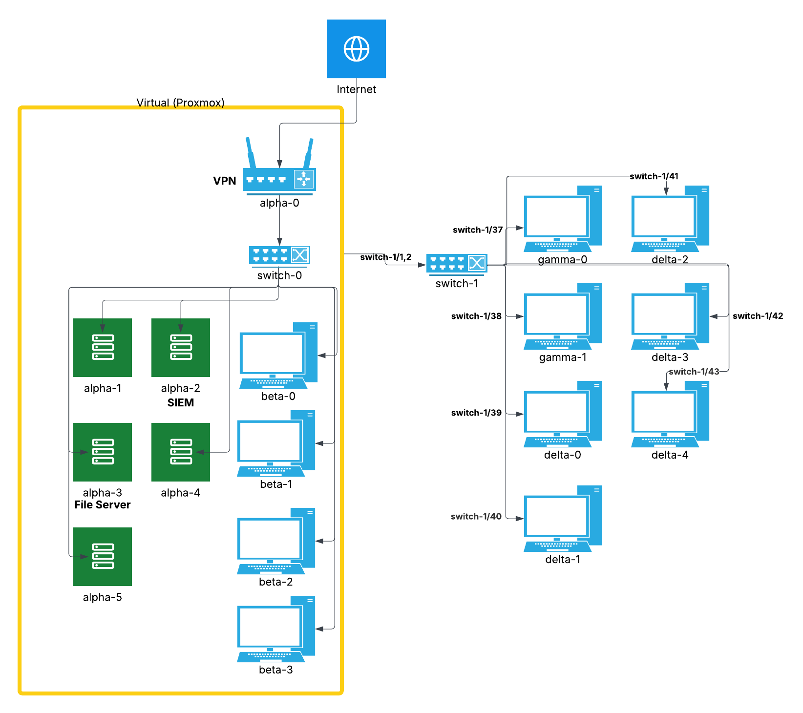

# Milestone 6

## Introduction

## Asset Inventory
#### Physical Workstations & Peripherals
* 7 Desktop computers
    * 7 power cables
    * 7 Ethernet cables
    * 8GB RAM, 256GB SSD, Intel Core i5
    * Ethernet NIC
    * Micro Form Factor
    * 4 thumbdrives for OS installers

* 2 Monitors, mice, keyboards
    * 7 Display Port cables
    * 2 power cables
    * 2 1080 monitors
    * 1 KVM
    * 2 USB hubs

#### VM Specifications
* Total RAM: 176
    * alpha-0: 16GB
    * alpha-1: 16GB
    * alpha-2: 32GB
    * alpha-3: 16GB
    * alpha-4: 16GB
    * alpha-5: 16GB
    * beta-0: 16GB
    * beta-1: 16GB
    * beta-2: 16GB
    * beta-3: 16GB
    
* Total CPU Cores: 44
    * alpha-0: 4
    * alpha-1: 4
    * alpha-2: 8
    * alpha-3: 4
    * alpha-4: 4
    * alpha-5: 4
    * beta-0: 4
    * beta-1: 4
    * beta-2: 4
    * beta-3: 4

* Total Storage: 492GB
    * alpha-0: 32GB
    * alpha-1: 20GB
    * alpha-2: 20GB
    * alpha-3: 20GB
    * alpha-4: 100GB
    * alpha-5: 100GB
    * beta-0: 50GB
    * beta-1: 50GB
    * beta-2: 50GB
    * beta-3: 50GB

#### Networking 
* 48 port switch with 2 PSUs
* Console cable
* 9 ethernet cables
* Switch and cable assignments:

    |   Switch Port |   Destination    |
    |-----|-----|
    |   1,2             |   Proxmox Switch  | 
    |   37  |   delta-6 |
    |   38  |   gamma-1 |
    |   39  |   delta-0 |
    |   40  |   delta-1 |
    |   41  |   delta-2 |
    |   42  |   delta-3 |
    |   43  |   delta-4 |

#### Backup
* Main backup server is alpha-

    --more here? if not delete--

#### VM Tagging and Pooling Strategy
* Descriptive, role based tags: dhcp, firewall, router, vpn, backup-server, dns, web-server, active-directory, db-server, metric-server, siem, vulnerability-scanner, file-server, workstation
* 2 pools: Servers-alpha & Workstations-beta

## Software Inventory
* **Router:** OPNSense
* **Firewall:** OPNSense
* **DNS:** BIND
* **SIEM & Endpoint Protection:** Wazuh
* **Vulnerability Scanning:** Nessus
* **Web Server:** Apache
* **VPN:** OPNSense
* **File Server:** TrueNAS
* **Database:** MySQL
* **Backup and Restore Solution:** Duplicati
* **DHCP Server:** OPNSense
* **Directory and Authentication:** Active Directory
* **Operating Systems:** Ubuntu, Kali Purple, Debian, Fedora, Windows Pro, Windows Server, TruNAS
* **Browser:** Chrome, Edge, Firefox
* **Code Editor:** VS Code

--more here? eg did we install office anywhere (or "plan to.") if not delete--

## Network Diagrams
Physical network diagram

Logical network diagram

## Network Tables

## Firewall Rules
The reasoning behind our firewall rules is relatively simple. The network requires access to the internet at large, meaning we need to have ports 80, 443, 123, and 53 allowed for HTTP, HTTPS, NTP, and DNS respectively. Each machine within the system must also have access to Active Directory, requiring the inclusion of ports 88, 636, and 135 for Kerberos, Encrypted LDAP, and RPC, respectively. Each VLAN has rules allowing it a certain amount of access to other VLANs. Executives, for example, are given access to all other VLANs because of their role. Additional ports to allow traffic for the File Server were added, specifically ports 137-139 and 445. We also allowed inbound traffic on ports 1514 and 1515 for our SIEM. These ports are necessary for TrueNAS to function as intended. Each of these ports was allowed for each VLAN, and no other rules were added so that the principle of least privilege was followed as closely as possible.

Each VLAN in our system allows ports needed for basic internet access as well as access to the file server and the SIEM. However, we have also implemented a deny-by-default rule to follow secuirty best practice and to enforce least privilege access. Each VLAN can only access what is absolutely necessary, and no more.

All firewall rules can be viewed in [this config file](config.xml).

## DNS Configuration

## File Server
I can do this - Chris

## Active Directory Integration

## Vulnerability Management

## VPN Access

## Backup & Disaster Recovery Policy

Separate Files to Include:

Switch configuration & VLAN database

DNS server configuration

Database schema in SQL format (wiki database)

Web server configuration

File server configuration:
[TrueNAS Configuration](ALPHA3-25.10.0.1-20251206184633.tar)

AD configuration

Risk assessment

Most recent vulnerability scan reports

VPN server configuration

